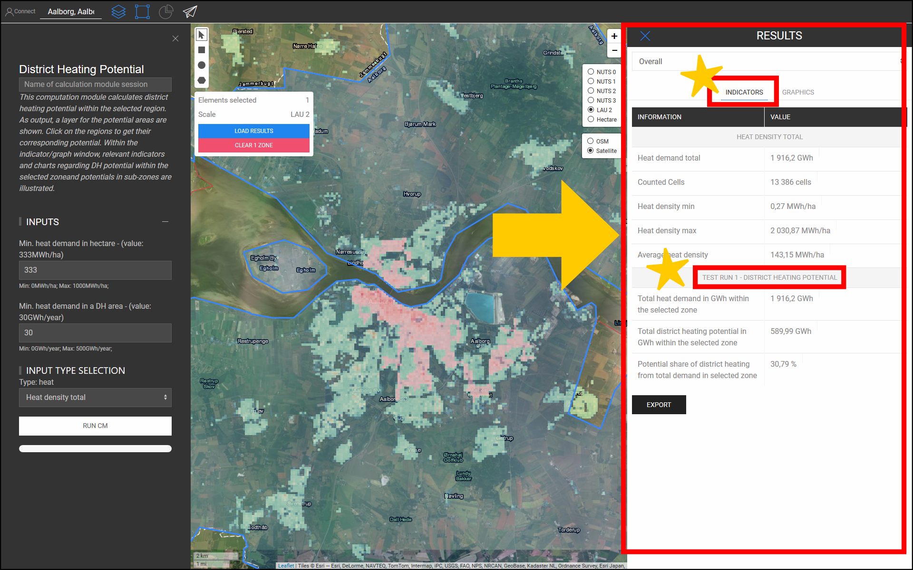

<h1><a class="anchor" id="cm-district-heating-potential-areas-user-defined-thresholds" href="#cm-district-heating-potential-areas-user-defined-thresholds"><i class="fa fa-link"></i></a>CM fjärrvärmepotentialområden användardefinierade trösklar</h1><h2><a class="anchor" id="table-of-contents" href="#table-of-contents"><i class="fa fa-link"></i></a> Innehållsförteckning</h2><ul><li> <a href="#in-a-glance">I en blick</a></li><li> <a href="#introduction">Introduktion</a></li><li> <a href="#inputs-and-outputs">In- och utgångar</a></li><li> <a href="#method">Metod</a></li><li> <a href="#github-repository-of-this-calculation-module">GitHub-förvar för denna beräkningsmodul</a></li><li> <a href="#sample-run">Provkörning</a><ul><li> <a href="#sample-run_test-run-1-default-input-values">Testkörning 1: standardinmatningsvärden</a></li><li> <a href="#sample-run_test-run-2-modified-input-values">Testkörning 2: modifierade ingångsvärden</a></li></ul></li><li> <a href="#how-to-cite">Hur man citerar</a></li><li> <a href="#authors-and-reviewers">Författare och granskare</a></li><li> <a href="#license">Licens</a></li><li> <a href="#acknowledgement">Bekräftelse</a></li></ul><h2><a class="anchor" id="in-a-glance" href="#in-a-glance"><i class="fa fa-link"></i></a> I en blick</h2>
 Denna beräkningsmodul beräknar fjärrvärmepotentialen inom det valda området med hjälp av två tröskelvärden: 1) Minsta värmebehov i varje hektar, 2) Lägsta värmebehov i ett DH-område. Områden inom den valda regionen som uppfyller dessa villkor returneras som DH-områden. Dessutom är värmebehovet i dessa regioner tillbaka i form av indikatorer som DH-potential.

 <a href="#table-of-contents"><strong><code>To Top</code></strong></a>
<h2><a class="anchor" id="introduction" href="#introduction"><i class="fa fa-link"></i></a> Introduktion</h2>
 Värmebehovet spelar en viktig roll vid bestämningen av potentiella fjärrvärmeområden (DH). Till exempel är implementeringen av fjärrvärme i områden med lågt värmebehov inte ekonomiskt lönsamt. Å andra sidan kan det vara felaktigt att definiera vilket område som helst med hög värmebehovstäthet som ett potentiellt DH-område. En hög värmebehovstäthet i ett område kan bero på närvaron av några få konsumenter med ett mycket högt värmebehov inom det området. Tvärtom kan en låg genomsnittlig värmebehovstäthet vara ett tecken på zoner med ett mycket lågt värmebehov inom det valda området. Syftet med beräkningsmodulen &quot;CM - DISTRICT HEATING POTENTIAL AREA: USER-DEFINED THRESHOLD&quot; är att ge en rimlig balans mellan värmebehovstätheten i ett område och dess bildande zoner.

 &quot;CM - DISTRICT HEATING POTENTIAL AREA: USER-DEFINED THRESHOLD&quot; bestämmer DH-områdena och deras motsvarande DH-potential baserat på värmebehovstätheten. Värmebehovstätheten erhålls från ett ingående GIS-lager. Hotmaps-verktygslådan och databasen ger en <strong><a href="https://gitlab.com/hotmaps/heat/heat_tot_curr_density">standardkarta för värmedensitet som</a></strong> kan användas i denna beräkningsmodul. Hotmaps värmetäthetskarta är i rasterformat och har en upplösning på en hektar och Coordinate Reference System (CRS) enligt &quot; <em><em>ETRS89 / LAEA Europe - EPSG 3035</em></em> &quot;. Cellerna på kartan visar värmetätheten i <em><strong>MWh / ha</strong></em> . Förutom denna standardkarta kan även kartor som genereras av användaren laddas upp till verktygslådan och användas i denna CM.

 Som utgång presenteras ett GIS-lager, tre indikatorer och två diagram. Dessa utgångar förklaras i detalj i avsnittet <a href="#sample-run">Provkörning</a> . Utmatningsskiktet visar de potentiella DH-områdena. Genom att klicka på varje område på kartan dyker ett fönster upp och den DH-potential som motsvarar det området visas. Inom fönstren INDIKATORER / GRAFIK i avsnittet RESULTAT i verktygslådan illustreras relevanta indikatorer och diagram angående DH-potential inom den valda zonen och potentialer i delzoner.

 <a href="#table-of-contents"><strong><code>To Top</code></strong></a>
<h2><a class="anchor" id="inputs-and-outputs" href="#inputs-and-outputs"><i class="fa fa-link"></i></a> In- och utgångar</h2>
 Ingångsparametrarna och -lagren, såväl som utgångslager och parametrar, är som följer.

 <strong>Ingångslager och parametrar är:</strong>
<ul><li> Lägsta värmebehov i varje hektar [ <em><strong>MWh / ha</strong></em> ]: ett värde mellan <em><em>0</em></em> och <em><em>1000</em></em></li><li> Lägsta värmebehov i ett DH-område [ <em><strong>GWh / år</strong></em> ]: ett värde mellan <em><em>0</em></em> och <em><em>500</em></em></li><li> Värmetäthetskarta: en standardkarta finns i verktygslådan. egna uppladdade kartor kan också användas i CM<ul><li> i rasterformat (* .tif)</li><li> med en hektar upplösning</li><li> efterfrågan på densiteter i <em><strong>MWh / ha</strong></em></li></ul></li></ul>
 <strong>Utgångslager och parametrar är:</strong>
<ul><li> DH-områden i raster- och shapefile-format</li><li> DH-potential i varje DH-område [ <em><strong>GWh / år</strong></em> ] (klicka på kartan)</li><li> Totalt värmebehov i GWh inom vald zon</li><li> Total fjärrvärmepotential i GWh inom vald zon</li><li> Potentiell andel fjärrvärme från totalt behov i vald zon</li></ul>
 <a href="#table-of-contents"><strong><code>To Top</code></strong></a>
<h2><a class="anchor" id="method" href="#method"><i class="fa fa-link"></i></a> Metod</h2>
 Potentialen för DH i en specifik region kan definieras av det totala värmebehovet och dess rumsliga fördelning. I Hotmaps-verktygslådan representeras värmebehovet i form av en rasterkarta. För att korrekt definiera potentiella DH-områden bör både värmebehovet i varje cell och även i ett område nå en viss nivå. Som utgångspunkt föreslår Hotmaps-verktygslådan standardvärden för dessa två parametrar. Beroende på fördelningen av värmebehovet och även de lokala förhållandena kan Hotmaps-användaren ändra dessa värden.

 Bestämningen av DH-områden görs i två steg:

 I det första steget filtreras alla celler med värmebehov under ingångsparametern &quot;Minsta värmebehov i hektar&quot;. Genom att eliminera dessa celler från kartan får vi grupper av celler som är fästa vid varandra. Varje uppsättning av dessa bifogade celler utgör små zoner som här kallas &quot;sammanhängande områden&quot;. I de andra stegen beräknas det totala värmebehovet i varje sammanhängande område. För det sammanhängande området, om det totala värmebehovet är högre än ingångsparametern &quot;Minsta värmebehov i ett DH-område&quot;, anses det vara ett potentiellt DH-område.

 Slutligen beräknas potentialen för DH-områden och presenteras i form av ett GIS-lager, vilket kan ses i verktygslådan.

 <a href="#table-of-contents"><strong><code>To Top</code></strong></a>
<h2><a class="anchor" id="github-repository-of-this-calculation-module" href="#github-repository-of-this-calculation-module"><i class="fa fa-link"></i></a> GitHub-förvar för denna beräkningsmodul</h2>
 <a href="https://github.com/HotMaps/dh_potential/tree/develop">Här</a> får du banbrytande utveckling för denna beräkningsmodul.

 <a href="#table-of-contents"><strong><code>To Top</code></strong></a>
<h2><a class="anchor" id="sample-run" href="#sample-run"><i class="fa fa-link"></i></a> Provkörning</h2>
 Här körs beräkningsmodulen för fallstudien om Aalborg i Danmark.
<ul><li> Använd först &quot;Gå till plats&quot; -fältet för att navigera till Aalborg och välj staden.</li></ul><ul><li>
 Följ stegen som visas i bilden nedan:
<ul><li> Klicka på knappen &quot;Lager&quot; för att öppna fönstret &quot;Lager&quot;:</li><li> Klicka på fliken &quot;BERÄKNINGSMODULER&quot;.</li><li> Klicka på &quot;CM-DISTRICT HEATING POTENTIAL AREAS: USER-DEFINED THRESHOLDS&quot; -knappen.</li></ul></li><li>
 Nu öppnas beräkningsmodulen &quot;CM-DISTRICT HEATING POTENTIAL AREAS: USER-DEFINED THRESHOLDS&quot; och är redo att köras.
</li></ul>
 <a href="#table-of-contents"><strong><code>To Top</code></strong></a>
<h3><a class="anchor" id="test-run-1--default-input-values" href="#test-run-1--default-input-values"><i class="fa fa-link"></i></a> Testkörning 1: standardinmatningsvärden</h3>
 Standardinmatningsvärdena visar de allmänna förhållandena under vilka ett område kan betraktas som ett potentiellt DH-område. Dessa värden bör endast betraktas som utgångspunkt. Du kan behöva ställa in värden under eller över standardvärdena i verktygslådan med tanke på ytterligare lokala förhållanden. Därför bör användaren anpassa dessa värden för att hitta den bästa kombinationen av trösklar för sin fallstudie.

 Så här kör du beräkningsmodulen:
<ul><li> Tilldela körningssessionen ett namn (valfritt - här valde vi &quot;Testkörning 1&quot;) och ställde in ingångsparametrarna (här användes standardvärden).</li></ul><ul><li> Tryck på knappen &quot;KÖR CM&quot; längst ner till vänster.</li><li> Vänta tills processen är klar.</li></ul>
 <strong><code>Note: If you wish to change your input parameters, you can press &quot;STOP CM&quot;, modify your input parameters and re-run the CM</code></strong>
<ul><li> Som output visas indikatorer och diagram i avsnittet &quot;RESULTAT&quot; till höger om verktygslådan. Indikatorerna visar:<ul><li> det totala värmebehovet i <em><em>GWh</em></em> inom vald zon,</li><li> total DH-potential i <em><em>GWh</em></em> inom vald zon,</li><li> andelen DH-potential från den totala efterfrågan, vilken erhålls genom att dividera DH-potentialen med det totala värmebehovet i regionen.</li></ul></li></ul>
 Dessutom genereras också två diagram. Den första visar DH-potentialen i varje DH-område. Motsvarande etiketter finns också på kartan. Det andra diagrammet illustrerar den totala DH-potentialen jämfört med det totala värmebehovet i det valda området.
<ul><li> Dessutom läggs ett nytt lager till duken som visar DH-områden. Detta lager läggs till i listan över lager under kategorin &quot;Beräkningsmodul&quot; längst ner i lageravsnittet. Körsessionens namn skiljer utgångarna från den här körningen från andra.</li></ul>
 Genom att följa dessa steg får du ett intryck av inmatningsvärdena och potentiella DH-områden.

 <a href="#table-of-contents"><strong><code>To Top</code></strong></a>
<h3><a class="anchor" id="test-run-2--modified-input-values" href="#test-run-2--modified-input-values"><i class="fa fa-link"></i></a> Testkörning 2: modifierade ingångsvärden</h3>
 Beroende på din erfarenhet och lokala kunskaper kan du öka eller minska ingångsvärdena för att få bättre resultat. I exempelvis Aalborg kanske du vet att värmebehovet i yttre stadsområden ligger relativt nära den centrala delen av staden och att DH-systemet också är möjligt i dessa områden. Därför kan du välja att minska det minsta värmebehovet i celler som ingår i ett DH-område; För att garantera tillräckligt med värmebehov kan du dock öka det lägsta värmebehovet i ett DH-område. Här kör du igen beräkningsmodulerna med nya ingångsparametrar.
<ul><li> Tilldela körningssessionen ett namn (valfritt - här valde vi &quot;Testkörning 2&quot;) och ställ in ingångsparametrarna ( <em><em>250 MWh / ha</em></em> i min. Värmebehov i hektar och <em><em>35 GWh / år</em></em> för minimibehovet i DH-området) .</li></ul><ul><li> Tryck på knappen &quot;KÖR CM&quot; längst ner till vänster.</li><li> Vänta tills processen är klar.</li><li> Som output visas indikatorer och diagram i avsnittet &quot;RESULTAT&quot; till höger om verktygslådan. Indikatorerna visar:<ul><li> det totala värmebehovet i <em><em>GWh</em></em> inom vald zon,</li><li> total DH-potential i <em><em>GWh</em></em> inom vald zon,</li><li> andelen DH-potential från den totala efterfrågan, som erhålls genom att dividera DH-potentialen med det totala värmebehovet i regionen.</li></ul></li></ul>
 Dessutom genereras också två diagram. Den första visar DH-potentialen i varje DH-område. Motsvarande etiketter finns också på kartan. Det andra diagrammet illustrerar den totala DH-potentialen jämfört med det totala värmebehovet i det valda området.
<ul><li> Dessutom läggs ett nytt lager till duken som visar DH-områden. Detta lager läggs till i listan över lager under kategorin &quot;Beräkningsmodul&quot;. Körsessionens namn skiljer utgångarna från den här körningen från andra.</li></ul>
 <a href="#table-of-contents"><strong><code>To Top</code></strong></a>
<h2><a class="anchor" id="how-to-cite" href="#how-to-cite"><i class="fa fa-link"></i></a> Hur man citerar</h2>
 Mostafa Fallahnejad, i Hotmaps-Wiki, CM-fjärrvärmepotentialområden: användardefinierade trösklar (april 2019)

 <a href="#table-of-contents"><strong><code>To Top</code></strong></a>
<h2><a class="anchor" id="authors-and-reviewers" href="#authors-and-reviewers"><i class="fa fa-link"></i></a> Författare och granskare</h2>
 Denna sida skrevs av Mostafa Fallahnejad ( <strong><a href="https://eeg.tuwien.ac.at/">EEG - TU Wien</a></strong> ).

 Den här sidan granskades av Marcul Hummel ( <strong><a href="https://e-think.ac.at">e-think</a></strong> ).

 <a href="#table-of-contents"><strong><code>To Top</code></strong></a>
<h2><a class="anchor" id="license" href="#license"><i class="fa fa-link"></i></a> Licens</h2>
 Copyright © 2016-2020: Mostafa Fallahnejad

 Creative Commons Attribution 4.0 internationell licens

 Detta arbete är licensierat under en Creative Commons CC BY 4.0 International License.

 SPDX-licensidentifierare: CC-BY-4.0

 Licenstext: https://spdx.org/licenses/CC-BY-4.0.html

 <a href="#table-of-contents"><strong><code>To Top</code></strong></a>
<h2><a class="anchor" id="acknowledgement" href="#acknowledgement"><i class="fa fa-link"></i></a> Bekräftelse</h2>
 Vi vill förmedla vår djupaste uppskattning till Horizon 2020 <a href="https://www.hotmaps-project.eu">Hotmaps-projektet</a> (bidragsöverenskommelse nummer 723677), som gav finansieringen för att genomföra denna undersökning.

 <a href="#table-of-contents"><strong><code>To Top</code></strong></a>

<!--- THIS IS A SUPER UNIQUE IDENTIFIER -->

This page was automatically translated. View in another language:

[English](../en/CM-District-heating-potential-areas-user-defined-thresholds) (original) [Bulgarian](../bg/CM-District-heating-potential-areas-user-defined-thresholds)\* [Czech](../cs/CM-District-heating-potential-areas-user-defined-thresholds)\* [Danish](../da/CM-District-heating-potential-areas-user-defined-thresholds)\* [German](../de/CM-District-heating-potential-areas-user-defined-thresholds)\* [Greek](../el/CM-District-heating-potential-areas-user-defined-thresholds)\* [Spanish](../es/CM-District-heating-potential-areas-user-defined-thresholds)\* [Estonian](../et/CM-District-heating-potential-areas-user-defined-thresholds)\* [Finnish](../fi/CM-District-heating-potential-areas-user-defined-thresholds)\* [French](../fr/CM-District-heating-potential-areas-user-defined-thresholds)\* [Irish](../ga/CM-District-heating-potential-areas-user-defined-thresholds)\* [Croatian](../hr/CM-District-heating-potential-areas-user-defined-thresholds)\* [Hungarian](../hu/CM-District-heating-potential-areas-user-defined-thresholds)\* [Italian](../it/CM-District-heating-potential-areas-user-defined-thresholds)\* [Lithuanian](../lt/CM-District-heating-potential-areas-user-defined-thresholds)\* [Latvian](../lv/CM-District-heating-potential-areas-user-defined-thresholds)\* [Maltese](../mt/CM-District-heating-potential-areas-user-defined-thresholds)\* [Dutch](../nl/CM-District-heating-potential-areas-user-defined-thresholds)\* [Polish](../pl/CM-District-heating-potential-areas-user-defined-thresholds)\* [Portuguese (Portugal, Brazil)](../pt/CM-District-heating-potential-areas-user-defined-thresholds)\* [Romanian](../ro/CM-District-heating-potential-areas-user-defined-thresholds)\* [Slovak](../sk/CM-District-heating-potential-areas-user-defined-thresholds)\* [Slovenian](../sl/CM-District-heating-potential-areas-user-defined-thresholds)\*  

\* machine translated
