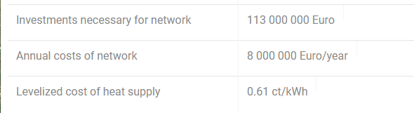

<h1><a class="anchor" id="cm-excess-heat-transport-potential" href="#cm-excess-heat-transport-potential"><i class="fa fa-link"></i></a>CM Överdriven värmetransportpotential</h1><h2><a class="anchor" id="table-of-contents" href="#table-of-contents"><i class="fa fa-link"></i></a> Innehållsförteckning</h2><ul><li> <a href="#in-a-glance">I en blick</a></li><li> <a href="#introduction">Introduktion</a></li><li> <a href="#inputs-and-outputs">In- och utgångar</a><ul><li> <a href="#inputs-and-outputs_input-layers-and-parameters">Mata in lager och parametrar</a></li><li> <a href="#inputs-and-outputs_output">Produktion</a></li></ul></li><li> <a href="#method">Metod</a><ul><li> <a href="#method_overview">Översikt</a></li><li> <a href="#method_details">Detaljer</a></li><li> <a href="#method_implementation">Genomförande</a></li></ul></li><li> <a href="#github-repository-of-this-calculation-module">GitHub-förvar för denna beräkningsmodul</a></li><li> <a href="#quick-start">Snabbstart</a></li><li> <a href="#troubleshooting">Felsökning</a></li><li> <a href="#sample-run">Provkörning</a></li><li> <a href="#how-to-cite">Hur man citerar</a></li><li> <a href="#authors-and-reviewers">Författare och granskare</a></li><li> <a href="#license">Licens</a></li><li> <a href="#acknowledgement">Bekräftelse</a></li></ul><h2><a class="anchor" id="in-a-glance" href="#in-a-glance"><i class="fa fa-link"></i></a> I en blick</h2>
 Denna modul beräknar flödet och kostnaderna för värmeöverföring från potentiella överflödiga värmekällor belägna utanför potentiella fjärrvärmeområden till fjärrvärmeområdet. Ingångarna är belastningsprofiler per timme av överflödet av värme och fjärrvärmebehovet, placeringen av överskottsvärmekällan och det potentiella fjärrvärmesystemet, investeringskostnader i värmeväxlare och transmissionsledningar och tröskelvärden för distans- och transmissionskostnader.

 <a href="#table-of-contents"><strong><code>To Top</code></strong></a>
<h2><a class="anchor" id="introduction" href="#introduction"><i class="fa fa-link"></i></a> Introduktion</h2>
 Beräkningsmodulen &quot;överflödig värmetransportpotential&quot; hjälper användaren att identifiera integrationspotentialer för överskottsvärme i fjärrvärmenät. Potentialerna baseras på <a href="https://wiki.hotmaps.hevs.ch/en/CM-District-heating-potential-areas-user-defined-thresholds">CM - Fjärrvärmepotentialen</a> . Denna CM identifierar områden med gynnsamma förhållanden för fjärrvärmenät och visar hur mycket värme som eventuellt kan täckas av industriellt överskottsvärme i dessa områden. Detta betyder dock inte att det redan finns ett fjärrvärmenät i denna region.

 Följande data och metoder kombineras för den tidigare uppgiften.

 Data:
<ul><li>
 Uppvärmningskrav för närliggande områden med gynnsamma förhållanden för fjärrvärmenät, som löses varje timme (från <a href="https://wiki.hotmaps.hevs.ch/en/CM-District-heating-potential-areas-user-defined-thresholds">CM - Fjärrvärmepotential</a> ).
</li><li>
 Uppgifter om överskottsvärmemängder från industriföretag i området, som också löses varje timme (från datamängden industriell databas).
</li><li>
 Antaganden om kostnader för värmeväxlare, pumpar och rörledningar samt värmeförluster för fjärrvärmeledningar.
</li></ul>
 Metod (förenklad):
<ul><li> Rörledningsdesign baserat på en utvecklad heuristik, som representerar designproblemet som ett nätverksflödesproblem.</li></ul>
 Syftet med metoden är att representera största möjliga överflödigt värmeflöde med inte för många och därmed för långa rörledningar till möjliga fjärrvärmeanvändare genom att generera nätverk med maximalt flöde. Särskilt ineffektiva transportledningar (med låga värmeströmmar och därmed höga specifika värmetransportkostnader) beaktas dock inte i det slutliga nätverket. Tröskeln för ekonomisk effektivitet för enskilda transportlinjer kan specificeras av användaren (se överföringslinjetröskel).

 Den grundläggande bakgrunden för tillvägagångssättet är som följer: om det bara finns några få värmekällor, kan en enda rörledning per källa alltid beaktas för att transportera värmen till ett närliggande område med gynnsamma förhållanden för fjärrvärme. Men om det finns flera överflödiga värmekällor som ska strömma in i samma område vore det meningsfullt att samla upp värmen och transportera den till området i en större gemensam rörledning. Tillvägagångssättet med ett rör per källa tenderar att överskatta ansträngningarna för rörledningarna.

 För att motverka ovanstående uppskattades problemet med rörledningsplanering genom att anta ett nätverksflödesproblem. En heuristisk metod används för att lösa problemet, där överskottsvärme kan buntas och transporteras till möjliga användare. Den konkreta metodiska utformningen av lösningen med tillvägagångssättet för det minsta spännträdet beskrivs i motsvarande metoddel. Rörledningsdesignen som fastställts i det föregående sammanhanget representerar därför inte en detaljerad planering eller verklig vägledning, utan används endast för att approximera kostnaderna för distribution av överskottsvärmemängderna i närliggande områden med gynnsamma förhållanden för fjärrvärmenät. (se <a href="https://wiki.hotmaps.hevs.ch/en/CM-District-heating-potential-areas-user-defined-thresholds">CM - Fjärrvärmepotential</a> , sammanhängande områden för nyckelord). Denna approximation av kostnader hänför sig alltså till hela nätverket.

 Resultaten bör sedan först tolkas på följande sätt: om de registrerade överskottsvärmemängderna skulle transporteras tillsammans till de angivna närliggande områdena, kan kostnaderna för värmefördelning vara i storleksordningen enligt verktyget (se Nivåiserad kostnad värmeförsörjning). Som regel är värdena för hela nätverket också en bra startindikator för enskilda rörledningar. Syftet med resultaten är därför att ge en projektutvecklare eller planerare en storleksordning för möjliga distributionskostnader.

 <a href="#table-of-contents"><strong><code>To Top</code></strong></a>
<h2><a class="anchor" id="inputs-and-outputs" href="#inputs-and-outputs"><i class="fa fa-link"></i></a> In- och utgångar</h2><h3><a class="anchor" id="input-layers-and-parameters" href="#input-layers-and-parameters"><i class="fa fa-link"></i></a> Mata in lager och parametrar</h3><h4><a class="anchor" id="provided-by-toolbox" href="#provided-by-toolbox"><i class="fa fa-link"></i></a> Tillhandahålls av Toolbox</h4><ul><li>
 Fjärrvärmeområden (för närvarande direkt tillhandahålls av fjärrvärmepotentialen CM)
</li><li>
 Industriell databas (som standard tillhandahålls av verktygslådan)
</li><li>
 Ladda profiler för industrin
</li><li>
 Lastprofiler för uppvärmning av bostäder och tappvarmvatten
</li></ul><h4><a class="anchor" id="provided-by-the-user" href="#provided-by-the-user"><i class="fa fa-link"></i></a> Tillhandahålls av användaren</h4><ul><li>
 Min. värmebehov per hektar

 Se <a href="https://wiki.hotmaps.hevs.ch/en/CM-District-heating-potential-areas-user-defined-thresholds">CM - potential för fjärrvärme</a> .
</li><li>
 Min. värmebehov i ett DH-område

 Se <a href="https://wiki.hotmaps.hevs.ch/en/CM-District-heating-potential-areas-user-defined-thresholds">CM - potential för fjärrvärme</a> .
</li><li>
 Utrustningens livstid i år

 Nivåiserade värmekostnader hänvisar till denna tidsperiod.
</li><li>
 Rabatt i%

 Räntesats för kredit som krävs för att bygga nätverket.
</li><li>
 Kostnadsfaktor

 Faktor för att anpassa nätverkskostnaderna om standardvärdena inte representerar kostnaderna exakt. De investeringar som krävs för nätverket multipliceras med denna faktor. Standardkostnader finns i avsnittet <a href="en-CM-Excess-heat-transport-potential#computation-of-costs">Beräkning av kostnader</a> .
</li><li>
 Driftskostnader i%

 Driftskostnader för nätverk per år. I procent av de investeringar som är nödvändiga för nätverket.
</li><li>
 Tröskelvärde för överföringsledningar i ct / kWh

 Den maximala nivåiserade värmekostnaden för varje enskild överföringsledning. Denna parameter kan användas för att kontrollera den nivåiserade värmekostnaden för hela nätverket. Ett lägre värde motsvarar lägre nivåiserad värmekostnad men också en minskning av överskottsvärme som används och tvärtom.
</li></ul><h4><a class="anchor" id="performance-parameters" href="#performance-parameters"><i class="fa fa-link"></i></a> Prestandaparametrar</h4><ul><li>
 Tidsupplösning

 Ställer in intervallet mellan nätverksflödesberäkningarna över hela året. Kan vara ett av dessa värden: (timme, dag, vecka, månad, år)
</li></ul>
 <a href="#table-of-contents"><strong><code>To Top</code></strong></a>
<h3><a class="anchor" id="output" href="#output"><i class="fa fa-link"></i></a> Produktion</h3><h4><a class="anchor" id="layers" href="#layers"><i class="fa fa-link"></i></a> Skikten</h4><ul><li>
 Överföringslinjer

 Formfil som visar de föreslagna överföringsledningarna med deras temperatur, årliga värmeflöde och kostnad. Detaljer hittar du här.
</li></ul><h4><a class="anchor" id="indicators" href="#indicators"><i class="fa fa-link"></i></a> Indikatorer</h4><ul><li>
 Totalt överskottsvärme i det valda området i GWh

 Totalt tillgängligt överskottsvärme från industrianläggningar i utvalt område och närhet.
</li><li>
 Överskottsvärme ansluten i GWh

 Totalt tillgängligt överskottsvärme för industrianläggningar anslutna till ett nätverk.
</li><li>
 Överskott av värme som används i GWh

 Faktiskt överskottsvärme som används för DH.
</li><li>
 Investeringar som är nödvändiga för nätverket i €

 Investeringar som behövs för att bygga nätverket.
</li><li>
 Årliga kostnader för nätverket i € / år

 Kostnader orsakade av livränta och driftskostnader för nätverket per år.
</li><li>
 Nivåiserade värmekostnader i ct / kWh

 nivåiserad värmekostnad för hela nätverket.
</li></ul><h4><a class="anchor" id="graphics" href="#graphics"><i class="fa fa-link"></i></a> Grafik</h4><ul><li>
 DH-potential och överskottsvärme

 Grafik som visar DH-potential, totalt överskottsvärme, anslutet överskottsvärme och använt överskottsvärme. Detaljer hittar du <a href="en-CM-Excess-heat-transport-potential#dh-potential-and-excess-heat">här</a> .
</li><li>
 Överskott av värme som används och investering krävs

 Grafik som visar årlig levererad överskottsvärme till den investering som krävs för nätverket. Detaljer hittar du <a href="en-CM-Excess-heat-transport-potential#excess-heat-used-and-investment-necessary">här</a> .
</li><li>
 Lastkurvor

 Grafik som visar månatligt värmebehov och överskott. Detaljer hittar du <a href="en-CM-Excess-heat-transport-potential#load-curves">här</a> .
</li><li>
 Lastkurvor

 Grafik som visar det genomsnittliga dagliga värmebehovet och överskottet. Detaljer hittar du <a href="en-CM-Excess-heat-transport-potential#load-curves">här</a> .
</li></ul><h4><a class="anchor" id="examples-of-layer" href="#examples-of-layer"><i class="fa fa-link"></i></a> Exempel på lager</h4><h5><a class="anchor" id="transmission-lines" href="#transmission-lines"><i class="fa fa-link"></i></a> Överföringslinjer</h5><figcaption> <i> Exempel på en överföringsledning som visas i verktygslådan</i></figcaption>
 Genom att klicka på överföringslinjen dyker ytterligare information upp.
<h4><a class="anchor" id="examples-of-graphics" href="#examples-of-graphics"><i class="fa fa-link"></i></a> Exempel på grafik</h4><h5><a class="anchor" id="dh-potential-and-excess-heat" href="#dh-potential-and-excess-heat"><i class="fa fa-link"></i></a> DH-potential och överskottsvärme</h5>
 <em>Denna bild jämför DH-potentialen, totalt överskottsvärme, anslutet överskottsvärme och använt överskottsvärme.</em>

 Mer information om det årliga värmebehovet och DH-potentialen finns <a href="CM-District-heating-potential-areas-user-defined-thresholds">här</a> . Det överskottsvärme som förbinds med överskottsvärme och använt överskottsvärme är detsamma som deras lika benämnda indikatorer, i avsnittet <a href="en-CM-Excess-heat-transport-potential#inputs-and-outputs_input-layers-and-parameters">Ingång och utgång</a> .
<h5><a class="anchor" id="load-curves" href="#load-curves"><i class="fa fa-link"></i></a> Lastkurvor</h5><figure><figcaption><i> </i>
 <i>Denna grafik visar det totala flödet genom nätverket under hela året. Den nedre grafiken representerar den genomsnittliga dagen.</i>
</figcaption></figure>
 X-axeln representerar tid och y-axelns effekt. De blå kurvorna representerar värmebehovet i DH-områdena och den röda överskottsvärmen som finns tillgänglig. Korsningen av båda kurvorna representerar det faktiska totala flödet av värme. Den övre grafiken visar flödet över året och den nedre flödet för den genomsnittliga dagen. Observera att <a href="en-CM-Excess-heat-transport-potential#performance-parameters">tidsupplösningen</a> måste ställas in åtminstone till &quot;månad&quot; för den övre och &quot;timme&quot; för att den nedre bilden ska vara representativ.

 <a href="#table-of-contents"><strong><code>To Top</code></strong></a>
<h2><a class="anchor" id="method" href="#method"><i class="fa fa-link"></i></a> Metod</h2><h3><a class="anchor" id="overview" href="#overview"><i class="fa fa-link"></i></a> Översikt</h3>
 Nyckelelementet i övervärmemodulen är den källsänksmodell som används. Den konstruerar ett överföringsnätverk med minsta längd och beräknar flödet för varje timme på året baserat på bostadsuppvärmningsbelastningsprofiler med NUTS 2-upplösning och industribelastningsprofiler med NUTS 0-upplösning. Baserat på genomsnittliga toppflöden under året kan kostnader för varje överföringsledning och värmeväxlare på käll- och diskbänk beräknas.

 <a href="#table-of-contents"><strong><code>To Top</code></strong></a>
<h3><a class="anchor" id="details" href="#details"><i class="fa fa-link"></i></a> Detaljer</h3><h4><a class="anchor" id="modeling-of-sources" href="#modeling-of-sources"><i class="fa fa-link"></i></a> Modellering av källor</h4>
 Baserat på NUTS 0 ID och industrisektorn tilldelas varje källa en årslönad lastprofil per timme.
<h4><a class="anchor" id="modeling-of-sinks" href="#modeling-of-sinks"><i class="fa fa-link"></i></a> Modellering av handfat</h4>
 Baserat på fjärrvärmepotential beräkningsmodul skapas lika stora ingångspunkter i de sammanhängande områdena. Beroende på ingångspunkterna NUTS 2 ID tilldelas en lastprofil.
<h4><a class="anchor" id="fixed-radius-search" href="#fixed-radius-search"><i class="fa fa-link"></i></a> Fast radiesökning</h4>
 Inom en förinställd radie kontrolleras vilka källor som ligger inom varandras intervall, vilka diskbänkar som ligger inom varandra och vilka diskbänkar som ligger inom källans räckvidd. Detta kan representeras av en graf med källor och sänkor som bildar hörnpunkterna och hörnpunkterna i området som är förbundna med en kant.
<h4><a class="anchor" id="reduction-to-minimum-length-network" href="#reduction-to-minimum-length-network"><i class="fa fa-link"></i></a> Minskning till minsta nätverk</h4>
 Ett minimalt spännande träd beräknas med avståndet mellan kanterna som vikter. Detta resulterar i att ett diagram bibehåller sin anslutning samtidigt som det har en minsta totala längd på kanterna. Observera att ingångspunkterna för sammanhängande områden är anslutna internt gratis eftersom de bildar sitt eget distributionsnät.
<h4><a class="anchor" id="flow-computation" href="#flow-computation"><i class="fa fa-link"></i></a> Flödesberäkning</h4>
 Det maximala flödet från källorna till sänkorna beräknas för varje timme på året.
<h4><a class="anchor" id="cost-determination" href="#cost-determination"><i class="fa fa-link"></i></a> Kostnadsbestämning</h4>
 Årets toppflöde i genomsnitt över 3 timmar avgör vilken kapacitet som krävs för överföringsledningarna och värmeväxlarna. Kostnaderna för överföringsledningarna beror på längd och kapacitet, medan värmeväxlarnas kostnader endast påverkas av kapaciteten. På källsidan antas luft till flytande värmeväxlare med integrerad pump för överföringsledningen och på diskbänken en vätska till flytande värmeväxlare.
<h4><a class="anchor" id="variation-of-network" href="#variation-of-network"><i class="fa fa-link"></i></a> Variation av nätverk</h4>
 Eftersom kostnaden och flödet för varje överföringsledning är känd kan linjerna med det högsta förhållandet mellan kostnad och flöde avlägsnas och flödet beräknas igen tills önskad kostnad per flöde uppnås.

 <a href="#table-of-contents"><strong><code>To Top</code></strong></a>
<h3><a class="anchor" id="implementation" href="#implementation"><i class="fa fa-link"></i></a> Genomförande</h3><h4><a class="anchor" id="fixed-radius-search" href="#fixed-radius-search"><i class="fa fa-link"></i></a> Fast radiesökning</h4>
 För beräkning av avståndet mellan två punkter används en liten vinkel approximation av loxodromlängden. Även om det också finns en korrekt implementering av ortodromavståndet har den ökade noggrannheten ingen verklig fördel på grund av de små avstånden som mest är lägre än 20 km och osäkerheten om den verkliga överföringsledningslängden på grund av många faktorer som topologi. Om två punkter ligger inom radieområdet lagras den i en angränsningslista. Skapandet av sådana närliggande listor utförs mellan källor och källor, sänkor och sänkor, och källor och sänkor. Anledningen till separationen ligger i flexibiliteten att lägga till vissa temperaturkrav för källor eller sänkor.
<figure><figcaption> <i> Exempel på en fast radiesökning. De röda hörnpunkterna representerar källor och de blå sjunker. Siffrorna representerar avståndet mellan punkterna. Ritning är inte i skala.</i></figcaption></figure><h4><a class="anchor" id="networkgraph-class" href="#networkgraph-class"><i class="fa fa-link"></i></a> NetworkGraph-klass</h4>
 Baserat på igraph-biblioteket implementeras en NetworkGraph-klass med alla funktioner som behövs för beräkningsmodulen. Medan igraph är dåligt dokumenterat erbjuder det mycket bättre prestanda än rena pythonmoduler som NetworkX och bredare plattformsstöd utöver Linux, till skillnad från grafverktyg. Klassen NetworkGraph beskriver bara ett nätverk på ytan men innehåller 3 olika grafer. För det första grafen som beskriver nätverket så som det definieras av de tre angränsningslistorna. För det andra sänker korrespondensdiagrammet internt sänkor av samma sammanhängande område och varar det maximala flödesdiagrammet som används för maximal flödesberäkning.
<h5><a class="anchor" id="graph" href="#graph"><i class="fa fa-link"></i></a> Graf</h5>
 Innehåller bara de verkliga källorna och sänker som hörn.
<figure><figcaption> <i> Exempel på ett diagram. De röda hörnpunkterna representerar källor och de blå sjunker.</i></figcaption></figure><h5><a class="anchor" id="correspondence-graph" href="#correspondence-graph"><i class="fa fa-link"></i></a> Korrespondensdiagram</h5>
 Varje handfat behöver ett korrespondens-ID, vilket indikerar om det är internt anslutet av ett redan existerande nätverk som i sammanhängande områden. Diskbänkar med samma korrespondens-ID är anslutna till ett nytt toppunkt med kanter med nollvikter. Detta är avgörande för beräkningen av ett minimalt spännande träd och anledningen till att korrespondensdiagrammet används för det. Denna funktion implementeras också för källor men används inte.
<figure><figcaption><i> </i>
 <i>Exempel på korrespondensdiagram. De röda hörnpunkterna representerar källor och de blå sjunker. De tre sänkorna till höger är sammanhängande förbundna med ett ytterligare större toppunkt</i>
</figcaption></figure><h5><a class="anchor" id="maximum-flow-graph" href="#maximum-flow-graph"><i class="fa fa-link"></i></a> Maximalt flödesdiagram</h5>
 Eftersom igraph inte stöder flera källor och sjunker i sin maximala flödesfunktion behövs ett hjälpdiagram. Det introducerar en oändlig källa och sänkspets. Varje verklig källa är ansluten till den oändliga källan och varje verklig diskbänk är ansluten till den oändliga diskbänken med en kant. Observera att om ett handfat är anslutet till ett korrespondenspunkt kommer detta toppunkt att anslutas snarare än själva diskbänken.
<figure><figcaption><i> </i>
 <i>Exempel på ett maximalt flödesdiagram.</i>
</figcaption></figure><h5><a class="anchor" id="minimum-spanning-tree-computation" href="#minimum-spanning-tree-computation"><i class="fa fa-link"></i></a> Minsta spännande trädberäkning</h5>
 Baserat på korrespondensdiagrammet beräknas det minsta spännande trädet. Kanterna som förbinder de sammanhängande diskbänkarna har alltid vikten 0 så att de alltid förblir en del av det minsta spännande trädet.
<figure><figcaption><i> </i>
 <i>Exempel på korrespondensdiagram med vikterna på varje kant och dess minsta spännande träd.</i>
</figcaption></figure><h5><a class="anchor" id="maximum-flow-computation" href="#maximum-flow-computation"><i class="fa fa-link"></i></a> Maximal flödesberäkning</h5>
 Flödet genom kanterna som förbinder de verkliga källorna eller sänkorna till den oändliga källan respektive sjunken är begränsad till den verkliga kapaciteten för varje källa eller sänka. Av numeriska skäl normaliseras kapaciteterna så att den största kapaciteten är 1. Flödet genom delmängden av kanter som finns i korrespondensdiagrammet är begränsat till 1000 vilket för alla intensiva och ändamål erbjuder obegränsat flöde. Därefter beräknas det maximala flödet från den oändliga källan till det oändliga sjunket och flödet omskalas till sin ursprungliga storlek. Eftersom koherenta diskbänkar inte är direkt anslutna till det oändliga diskbänken utan genom korrespondenspunkten är flödet genom det begränsat till summan av alla koherenta diskbänkar.
<figure><figcaption><i> </i>
 <i>Exempel på ett maximalt flödesdiagram och kapaciteten för varje källa och diskbänk. Den högra grafen visar det maximala flödet som tillåts genom varje kant efter normaliseringen. Observera att det maximala flödet som tillåts genom kanterna med oändlighetssymbol faktiskt är begränsat till 1000 i implementeringen.</i>
</figcaption></figure>
 Implementeringen av igraph maximala flödesfunktionen använder algoritmen Push-relabel. Denna typ av algoritm är inte kostnadskänslig och kanske inte alltid hittar det kortaste sättet att dirigera flödet. En kostnadskänslig algoritm är inte tillgänglig i igraph och prestandan skulle sannolikt vara låg för att kunna lösa ett timbaserat flöde under hela året. Men på grund av den tidigare minskningen till ett minimum som spänner över trädet är de fall där en icke-idealisk lösning väljs mycket begränsade och osannolika. Push-relabel-algoritmen har också en tendens att dirigera flödet genom minsta mängd kanter. Imgrafimplementeringen verkar vara avgörande i ordningen för fördelning av flödet om graferna är åtminstone automorfismer, vilket är viktigt för den timbaserade flödesberäkningen eftersom någon artificiellt införd flödesoscillation mellan kanterna är oönskad.
<figure><figcaption> <i> Flöde beräknat med maximal flödesalgoritm och omskalning till originalstorleken.</i></figcaption></figure><h4><a class="anchor" id="heat-sources" href="#heat-sources"><i class="fa fa-link"></i></a> Värmekällor</h4>
 Värmekällorna hämtas från den <strong><a href="https://gitlab.com/hotmaps/industrial_sites/industrial_sites_Industrial_Database">industriella databasen.</a></strong> Baserat på deras överskottsvärme skapas Nuts0 ID och industrisektorn en lastprofil som täcker varje timme på året för varje anläggning. Det anpassade tillägget av webbplatser planeras.
<h4><a class="anchor" id="heat-sinks" href="#heat-sinks"><i class="fa fa-link"></i></a> Värme sjunker</h4>
 Kylflänsarna baseras på sammanhängande områden med känt värmebehov. De sammanhängande områdena bildar en mask för ett rutnät där lika avståndspunkter placeras som ingångspunkter. Beroende på valt NUTS 2 ID tilldelas sänkorna en bostadsvärmeprofil. Det anpassade tillägget av ingångspunkter och handfat planeras.
<figure><figcaption> <i> Exempel på ett sammanhängande område och dess genererade ingångspunkter.</i></figcaption></figure><h4><a class="anchor" id="load-profiles" href="#load-profiles"><i class="fa fa-link"></i></a> Ladda profiler</h4>
 De nämnda lastprofilerna består av 8760 poäng som representerar belastningen för varje timme under 365 dagar. Mer information om <strong><a href="https://gitlab.com/hotmaps/load_profile">lastprofilerna finns här.</a></strong>
<h4><a class="anchor" id="computation-of-costs" href="#computation-of-costs"><i class="fa fa-link"></i></a> Kostnadsberäkning</h4>
 Eftersom fjärrvärmesystem har en stor värmekapacitet betyder en topp i flödet inte att överföringsledningarna behöver leverera den korta värmepiken omedelbart. Därför bestäms de nödvändiga kapaciteterna för överföringsledningarna och värmeväxlarna av den genomsnittliga toppbelastningen. Specifikt används den bedövade fällningsfunktionen för att genomsnittsflödet under de senaste tre timmarna genom att krångla med en konstant funktion. Beroende på detta värde väljs en överföringsledning från följande tabell.

 <em>Specifika kostnader för överföringsledningar som används</em>

 | Effekt i MW | Kostnader i € / m | Temperatur i ° C | ------------- |: -------------: | -----: | | 0,2 | 195 | &lt;150 | | 0,3 | 206 | &lt;150 | | 0,6 | 220 | &lt;150 | | 1.2 | 240 | &lt;150 | | 1.9 | 261 | &lt;150 | | 3.6 | 288 | &lt;150 | | 6.1 | 323 | &lt;150 | | 9.8 | 357 | &lt;150 | | 20 | 426 | &lt;150 | | 45 | 564 | &lt;150 | | 75 | 701 | &lt;150 | | 125 | 839 | &lt;150 | | 190 | 976 | &lt;150 | | &gt; 190 | 976 | &lt;150 |

 Kostnaderna för värmeväxlaren på källsidan som antas som luft till vätska beräknas med

 C HS-källa (en-P) = P- topp * 15 000 € / MW.

 Kostnaderna för vätska till flytande värmeväxlare på diskbänken bestäms med

 C HSink (sv-P) = P- topp * 265 000 € / MW om P- topp &lt;1 MW eller

 C HSink (en-P) = P- topp * 100.000 € / MW annat.
<h4><a class="anchor" id="removal-of-transmission-lines" href="#removal-of-transmission-lines"><i class="fa fa-link"></i></a> Borttagning av överföringsledningar</h4>
 Med en tröskel för kostnad för flöde för överföringsledningar kan de tas bort om de överskrider den för att förbättra förhållandet mellan flöde och kostnad. Efter avlägsnande av kanter måste flödet beräknas om igen eftersom kontinuiteten i flödet i diagrammet inte längre garanteras. Kostnadsflödesförhållandet kan också öka för andra kanter nu, så denna process upprepas tills summan av alla flöden inte förändras längre.
<h4><a class="anchor" id="description-of-the-complete-routine" href="#description-of-the-complete-routine"><i class="fa fa-link"></i></a> Beskrivning av hela rutinen</h4>
 För det första laddas värmekällorna och sänkorna med deras belastningsprofiler. Sedan utförs den fasta radiesökningen och nätverket initieras. Därefter reduceras nätverket till sitt minsta spännande träd och det maximala flödet beräknas för varje timme på året. Baserat på flödet beräknas kostnaderna för varje värmeväxlare, pump och transmissionsledning. Om ett tröskelvärde för kostnad / flöde definieras utförs proceduren för överföring av överföringsledningen. Till slut returneras nätverkets totala kostnad och totala flöde och layouten för nätverket.

 <a href="#table-of-contents"><strong><code>To Top</code></strong></a>
<h2><a class="anchor" id="github-repository-of-this-calculation-module" href="#github-repository-of-this-calculation-module"><i class="fa fa-link"></i></a> GitHub-förvar för denna beräkningsmodul</h2>
 <a href="https://github.com/HotMaps/excess_heat_cm/tree/develop">Här</a> får du banbrytande utveckling för denna beräkningsmodul.

 <a href="#table-of-contents"><strong><code>To Top</code></strong></a>
<h2><a class="anchor" id="quick-start" href="#quick-start"><i class="fa fa-link"></i></a> Snabbstart</h2>
 Den nuvarande CM - EXCESS HEAT TRANSPORT POTENTIAL är avsedd att hjälpa användaren att identifiera integrationspotentialer för övervärme i fjärrvärmenät. Även om många analysfunktioner ges för att inte begränsa användaren måste det uttryckligen påpekas att detta inte är detaljerad teknisk planering. Potentialerna baseras på <a href="https://wiki.hotmaps.hevs.ch/en/CM-District-heating-potential-areas-user-defined-thresholds">CM - Fjärrvärmepotentialen</a> . Denna CM identifierar områden med gynnsamma förhållanden för fjärrvärmenät. Således visar det hur mycket värme som kan täckas av industriell överskottsvärme i dessa områden. Detta betyder dock inte att det redan finns ett fjärrvärmenät i denna region. En applikationsorienterad användning av verktyget för utövare kan därför se ut så här:
<ul><li>
 Om det behövs kan du lägga till dina egna uppgifter om överskottsvärme som ger företag i regionen <a href="https://wiki.hotmaps.hevs.ch/en/CM-Add-industry-plant">tillsatsindustrin</a> CM.
</li><li>
 Slå på &quot;Industriområden överflödig värme&quot;
</li><li>
 Kör CM - EXCESS HEAT TRANSPORT POTENTIAL.
</li><li>
 Värdet
</li></ul><figure><figcaption> <i>Denna bild jämför DH-potentialen, totalt överskottsvärme, anslutet överskottsvärme och använt överskottsvärme.</i></figcaption></figure>
 Denna bild visar hur mycket värme som kan täckas av överskott av värme i det undersökta området.
<ul><li> Värde</li></ul><figure><figcaption> <i>Indikatorer Nödvändiga investeringar, Årskostnader och nivåiserad värmekostnad</i></figcaption></figure>
 Denna bild visar de specifika värmeproduktionskostnaderna för hela nätverket. Obs: de visade kostnaderna har uppskattats med en förenklad metod. Dessa kostnader gäller inte enskilda rörledningar. De visade kostnaderna kan dock användas som ett förenklat startantag som transportkostnader för integrering av överskottsvärme i ett eventuellt närliggande fjärrvärmenät.

 Från ovanstående kan följande arbetshierarki användas:
<ol><li>
 Kontrollera om det finns ett fjärrvärmenätverk eller planeras i den aktuella regionen.
</li><li>
 De visade rören innehåller flöden. Där kan du se hur mycket överskottsvärme som transporteras från respektive källa. De berörda företagen kunde nu kontaktas. Förmodligen först företagen med stora kvantiteter.
</li></ol><figure><figcaption> <i>Överföringsledning och dess flöde</i></figcaption></figure><ol start="3"><li> Om operatören av fjärrvärmenätet och producenten av överskottsvärme är intresserade av att samarbeta kan mer detaljerade genomförbarhetsstudier beställas. I bästa fall hjälper de visade uppgifterna till att initiera riktiga projekt.</li></ol>
 <a href="#table-of-contents"><strong><code>To Top</code></strong></a>
<h2><a class="anchor" id="troubleshooting" href="#troubleshooting"><i class="fa fa-link"></i></a> Felsökning</h2><h3><a class="anchor" id="cm-does-not-finish" href="#cm-does-not-finish"><i class="fa fa-link"></i></a> CM slutar inte</h3><ul><li> Minska rumslig upplösning</li><li> Minska tidsupplösningen</li><li> Välj mindre område</li><li> Kör om vid en senare tidpunkt</li></ul><h3><a class="anchor" id="cm-crashes-without-a-message" href="#cm-crashes-without-a-message"><i class="fa fa-link"></i></a> CM kraschar utan ett meddelande</h3><ul><li> Kör om vid en senare tidpunkt</li><li> Kontakta CM-utvecklare</li></ul><h3><a class="anchor" id="error--"no-dh-area-in-selection."" href="#error--"no-dh-area-in-selection.""><i class="fa fa-link"></i></a> Fel: &quot;Inget DH-område i valet.&quot;</h3>
 Markera <a href="https://wiki.hotmaps.hevs.ch/en/CM-District-heating-potential-areas-user-defined-thresholds">DH Potential CM för</a> att anpassa ingångarna så att ett DH-område skapas.
<h3><a class="anchor" id="error--"no-industrial-sites-in-the-selected-area."" href="#error--"no-industrial-sites-in-the-selected-area.""><i class="fa fa-link"></i></a> Fel: &quot;Inga industrianläggningar i det valda området.&quot;</h3>
 Kontrollera lagret &quot;industrianläggningar&quot; i användarvalet.
<h3><a class="anchor" id="error--"no-entry-points-in-selected-area."" href="#error--"no-entry-points-in-selected-area.""><i class="fa fa-link"></i></a> Fel: &quot;Inga ingångspunkter i valt område.&quot;</h3>
 Kontrollera <a href="#troubleshooting_warning-no-industry-profiles-available-for">varningen</a> .
<h3><a class="anchor" id="error--"no-industrial-sites-in-range."" href="#error--"no-industrial-sites-in-range.""><i class="fa fa-link"></i></a> Fel: &quot;Inga industrianläggningar inom räckhåll.&quot;</h3>
 Välj ett större område där du hittar minst en industrianläggning baserat på standardindustridatainställningen som är tillgänglig i Hotmaps-verktygslådan.
<h3><a class="anchor" id="error--"no-excess-heat-used."" href="#error--"no-excess-heat-used.""><i class="fa fa-link"></i></a> Fel: &quot;Ingen överskottsvärme används.&quot;</h3>
 Öka <a href="#inputs-and-outputs_input-layers-and-parameters_provided-by-the-user">överföringsledningströskeln</a>
<h3><a class="anchor" id="warning--"no-industry-profiles-available-for-..."" href="#warning--"no-industry-profiles-available-for-...""><i class="fa fa-link"></i></a> Varning: &quot;Inga branschprofiler tillgängliga för ...&quot;</h3>
 Kontrollera land och undersektor för uppladdade industrianläggningar.
<h3><a class="anchor" id="warning--"no-residential-heating-profile-available-for-..."" href="#warning--"no-residential-heating-profile-available-for-...""><i class="fa fa-link"></i></a> Varning: &quot;Ingen bostadsuppvärmningsprofil tillgänglig för ...&quot;</h3>
 CM har inte tillgång till bostadsuppvärmningsprofildata som ska köras i detta område.

 <a href="#table-of-contents"><strong><code>To Top</code></strong></a>
<h2><a class="anchor" id="sample-run" href="#sample-run"><i class="fa fa-link"></i></a> Provkörning</h2>
 Provkörning i PL22 med standardparametrar. Vi rekommenderar att du slår på övervärmningsplatser i fliken lager.
<figure><figcaption> <i>Provkörning i PL22. De rosa områdena representerar fjärrvärmen. Den orange cirklar värmekällan och den orange leder nätets överföringslinjer.</i></figcaption></figure><figure><figcaption> <i> Denna grafik visar det totala flödet genom nätverket under hela året. Den nedre grafiken representerar den genomsnittliga dagen. Eftersom standardtidsupplösningen är inställd på &quot;vecka&quot; är den konstant i detta fall.</i></figcaption></figure>
 <a href="#table-of-contents"><strong><code>To Top</code></strong></a>
<h2><a class="anchor" id="how-to-cite" href="#how-to-cite"><i class="fa fa-link"></i></a> Hur man citerar</h2>
 Ali Aydemir och David Schilling, i Hotmaps Wiki, CM Överdriven värmetransportpotential (september 2020)

 <a href="#table-of-contents"><strong><code>To Top</code></strong></a>
<h2><a class="anchor" id="authors-and-reviewers" href="#authors-and-reviewers"><i class="fa fa-link"></i></a> Författare och granskare</h2>
 Denna sida skrevs av Ali Aydemir och David Schilling ( <strong><a href="https://isi.fraunhofer.de/">Fraunhofer ISI</a></strong> ).

 Denna sida granskades av Tobias Fleiter ( <strong><a href="https://isi.fraunhofer.de/">Fraunhofer ISI</a></strong> ).

 <a href="#table-of-contents"><strong><code>To Top</code></strong></a>
<h2><a class="anchor" id="license" href="#license"><i class="fa fa-link"></i></a> Licens</h2>
 Copyright © 2016-2020: Ali Aydemir och David Schilling

 Creative Commons Attribution 4.0 internationell licens

 Detta arbete är licensierat under en Creative Commons CC BY 4.0 International License.

 SPDX-licensidentifierare: CC-BY-4.0

 Licenstext: https://spdx.org/licenses/CC-BY-4.0.html

 <a href="#table-of-contents"><strong><code>To Top</code></strong></a>
<h2><a class="anchor" id="acknowledgement" href="#acknowledgement"><i class="fa fa-link"></i></a> Bekräftelse</h2>
 Vi vill förmedla vår djupaste uppskattning till Horizon 2020 <a href="https://www.hotmaps-project.eu">Hotmaps-projektet</a> (bidragsavtal nummer 723677), som gav finansieringen för att genomföra den nuvarande utredningen.

 <a href="#table-of-contents"><strong><code>To Top</code></strong></a>

<!--- THIS IS A SUPER UNIQUE IDENTIFIER -->

This page was automatically translated. View in another language:

[English](../en/CM-Excess-heat-transport-potential) (original) [Bulgarian](../bg/CM-Excess-heat-transport-potential)\* [Czech](../cs/CM-Excess-heat-transport-potential)\* [Danish](../da/CM-Excess-heat-transport-potential)\* [German](../de/CM-Excess-heat-transport-potential)\* [Greek](../el/CM-Excess-heat-transport-potential)\* [Spanish](../es/CM-Excess-heat-transport-potential)\* [Estonian](../et/CM-Excess-heat-transport-potential)\* [Finnish](../fi/CM-Excess-heat-transport-potential)\* [French](../fr/CM-Excess-heat-transport-potential)\* [Irish](../ga/CM-Excess-heat-transport-potential)\* [Croatian](../hr/CM-Excess-heat-transport-potential)\* [Hungarian](../hu/CM-Excess-heat-transport-potential)\* [Italian](../it/CM-Excess-heat-transport-potential)\* [Lithuanian](../lt/CM-Excess-heat-transport-potential)\* [Latvian](../lv/CM-Excess-heat-transport-potential)\* [Maltese](../mt/CM-Excess-heat-transport-potential)\* [Dutch](../nl/CM-Excess-heat-transport-potential)\* [Polish](../pl/CM-Excess-heat-transport-potential)\* [Portuguese (Portugal, Brazil)](../pt/CM-Excess-heat-transport-potential)\* [Romanian](../ro/CM-Excess-heat-transport-potential)\* [Slovak](../sk/CM-Excess-heat-transport-potential)\* [Slovenian](../sl/CM-Excess-heat-transport-potential)\*  

\* machine translated
