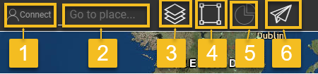

<h1><a class="anchor" id="introduction-to-user-interface" href="#introduction-to-user-interface"><i class="fa fa-link"></i></a>Introduktion till användargränssnitt</h1><h2><a class="anchor" id="table-of-contents" href="#table-of-contents"><i class="fa fa-link"></i></a> Innehållsförteckning</h2><ul><li>
 <a href="#introduction-page">Introduktionssida</a>
</li><li>
 <a href="#upper-toolbar">Övre verktygsfältet</a>
<ul><li> <a href="#upper-toolbar_connect">Ansluta</a><ul><li> <a href="#upper-toolbar_connect_login">Logga in</a></li><li> <a href="#upper-toolbar_connect_register">Registrera</a></li><li> <a href="#upper-toolbar_connect_recover">Ta igen sig</a></li></ul></li><li> <a href="#upper-toolbar_go-to-place">Gå till plats</a></li><li> <a href="#upper-toolbar_layers">Skikten</a></li><li> <a href="#upper-toolbar_selection-tools">Urvalsverktyg</a></li><li> <a href="#upper-toolbar_show-result">Visa resultat</a></li><li> <a href="#upper-toolbar_feedback">Respons</a></li><li> <a href="#upper-toolbar_save-session">Spara session</a></li><li> <a href="#upper-toolbar_save-session-folder">Spara sessionsmapp</a></li></ul></li><li>
 <a href="#tiles">Plattor</a>
</li><li>
 <a href="#how-to-cite">Hur man citerar</a>
</li><li>
 <a href="#authors-and-reviewers">Författare och granskare</a>
</li><li>
 <a href="#license">Licens</a>
</li><li>
 <a href="#acknowledgement">Bekräftelse</a>
</li></ul><h2><a class="anchor" id="introduction-page" href="#introduction-page"><i class="fa fa-link"></i></a> Introduktionssida</h2>
 När verktygslådan öppnas visas ansvarsfriskrivningssidan. Förutom ansvarsfriskrivningsmeddelandet tillhandahålls ytterligare information om webbläsare som stöds, målen för Hotmaps-projektet, länken till Hotmaps-projektwebbplatsen och datalagren.

 <em>Fig. 1 Kort introduktion till Hotmaps-verktygslådan</em>

 Hotmaps GUI är ett GIS-baserat gränssnitt. Genom att stänga sidan för ansvarsfriskrivning ser användaren kartan över Europa. Som standard visas värmebehovstäthetskartan för EU-28-länder och NUTS 2-gränser. Förutom dessa två kartor kan vissa verktyg och knappar ses i GUI. Dessa verktyg illustreras i följande bild.

 <em>Fig. 2 Första sidan</em>

 Här kan du vid första anblicken se 3 delar av användargränssnittet:
<ol><li> <a href="#upper-toolbar">ett verktygsfält längst upp till vänster</a> ,</li><li> själva kartan</li><li> <a href="#tiles">några verktyg för att ändra kartstilen</a> .</li><li> två länkar uppe till höger: till denna <a href="https://wiki.hotmaps.eu/">Hotmaps-Wiki</a> och till <a href="https://www.hotmaps-project.eu/">Hotmaps-projektets webbplats</a> .</li></ol>
 I de följande kapitlen förklaras de första 3 punkterna i detalj.

 <a href="#table-of-contents"><strong><code>To Top</code></strong></a>
<h2><a class="anchor" id="upper-toolbar" href="#upper-toolbar"><i class="fa fa-link"></i></a> Övre verktygsfältet</h2>

 Med det här verktygsfältet kan du:
<ol><li> <a href="#upper-toolbar_connect"><em>Anslut:</em></a> registrera dig och logga in på webbapplikationen för att spara ditt arbete,</li><li> <a href="#upper-toolbar_go-to-place"><em>Gå till plats:</em></a> zooma in till en viss region genom att skriva namnet,</li><li> <a href="#upper-toolbar_layers"><em>Lager:</em></a> visa sidofältet för lagret,</li><li> <a href="#upper-toolbar_selection-tools"><em>Markeringsverktyg</em> :</a> aktivera eller inaktivera markeringsverktygen,</li><li> <a href="#upper-toolbar_show-result"><em>Visa resultat:</em></a> visa resultatsidfältet för dina valda regioner,</li><li> <a href="#upper-toolbar_feedback"><em>Feedback:</em></a> ge oss feedback angående verktyget,</li><li> <a href="#upper-toolbar_save-session"><em>Spara session:</em></a> du kan spara valda lager och zoomnivå och återkalla dem senare,</li><li> <a href="#upper-toolbar_save-session-folder"><em>Spara sessionsmapp:</em></a> där du kan se listan över alla sparade sessioner.</li></ol>
 <a href="#table-of-contents"><strong><code>To Top</code></strong></a>
<h3><a class="anchor" id="connect" href="#connect"><i class="fa fa-link"></i></a> Ansluta</h3>
 Här kan du:
<ul><li> Skapa ett konto</li><li> Logga in på ditt konto för att spara dina framsteg</li><li> Eller återställ lösenordet om du glömmer det</li></ul>
 <a href="#table-of-contents"><strong><code>To Top</code></strong></a>
<h4><a class="anchor" id="login" href="#login"><i class="fa fa-link"></i></a> Logga in</h4>
 Efter att du har <a href="#register">registrerat</a> och aktiverat ditt konto bör du kunna logga in med din e-postadress och lösenord (se <a href="#fig4">figur 4</a> nedan).

 <em>Bild 4: Inloggningsformulär</em>

 <a href="#table-of-contents"><strong><code>To Top</code></strong></a>
<h4><a class="anchor" id="register" href="#register"><i class="fa fa-link"></i></a> Registrera</h4>
 Här kan du skapa ett konto för <em>hotmaps-</em> webbplatsen. Efter att ha skickat <a href="#fig5">formuläret</a> kommer du att få ett e-postmeddelande för att aktivera ditt konto. Med ditt konto kommer du att kunna spara dina framsteg.

 <em>Bild 5: Registreringsformulär</em>

 <a href="#table-of-contents"><strong><code>To Top</code></strong></a>
<h4><a class="anchor" id="recover" href="#recover"><i class="fa fa-link"></i></a> Ta igen sig</h4>
 Om du någonsin glömmer ditt lösenord kan du återställa det under den här menyn (se <a href="#fig6">bild 6</a> nedan). Tänk på att ställa in ett nytt lösenord efteråt.

 <em>Bild 6: Återställ formulär</em>

 <a href="#table-of-contents"><strong><code>To Top</code></strong></a>
<h3><a class="anchor" id="go-to-place" href="#go-to-place"><i class="fa fa-link"></i></a> Gå till plats</h3>
 Du kan zooma till en viss region genom att skriva dess namn (se animering nedan)

 <a href="#table-of-contents"><strong><code>To Top</code></strong></a>
<h3><a class="anchor" id="layers" href="#layers"><i class="fa fa-link"></i></a> Skikten</h3>
 Genom att trycka på denna knapp visas en sidofält med olika typer av lager till vänster.

 Följande lager kan hittas och visualiseras:

 <a href="#table-of-contents"><strong><code>To Top</code></strong></a>
<h3><a class="anchor" id="selection-tools" href="#selection-tools"><i class="fa fa-link"></i></a> Urvalsverktyg</h3>
 Genom att trycka på den här knappen visas markeringsverktygen till vänster på skärmen

 Bilden nedan visar hur verktygen ser ut:

<ol><li> Verktyg för val av regioner</li><li> Skapa en anpassad kvadratregion</li><li> Skapa en anpassad cirkelregion</li><li> Skapa en anpassad polygonregion</li><li> Ladda upp ett GeoJSON-objekt för att använda ett anpassat områdesval</li></ol><ol type="A"><li> visar hur många regioner du har valt</li><li> visar den totala ytan på den minsta rektangulen som kan täcka det valda området</li><li> visar skalan du valt från det högra verktygsfältet</li></ol><ol type="a"><li> knapp för att ladda resultaten för din valda region och valda lager</li><li> för att radera en vald region</li></ol>
 <a href="#table-of-contents"><strong><code>To Top</code></strong></a>
<h3><a class="anchor" id="show-result" href="#show-result"><i class="fa fa-link"></i></a> Visa resultat</h3>
 Beroende på vilka lager och region du har valt visas resultaten för din konfiguration i ett sidofält till höger på skärmen

 <a href="#table-of-contents"><strong><code>To Top</code></strong></a>
<h3><a class="anchor" id="feedback" href="#feedback"><i class="fa fa-link"></i></a> Respons</h3>
 Har du några förslag på hur du kan förbättra verktyget? Har du märkt några fel? Vänligen meddela oss! Genom att ge oss feedback kan du hjälpa oss att förbättra verktygslådan!

 Fyll i <a href="#Fig7">formuläret</a> nedan:

 <a href="#table-of-contents"><strong><code>To Top</code></strong></a>

 du kan välja mellan följande typer:

 och sätt en prioritet:

 <a href="#table-of-contents"><strong><code>To Top</code></strong></a>
<h3><a class="anchor" id="save-session" href="#save-session"><i class="fa fa-link"></i></a> Spara session</h3>
 Du kan göra en ögonblicksbild av ditt arbete (utvalda områden och lager, zoomnivåer osv.) genom att trycka på den här knappen. Du kan också definiera ett namn och en beskrivning av ögonblicksbilden.
<h3><a class="anchor" id="save-session-folder" href="#save-session-folder"><i class="fa fa-link"></i></a> Spara sessionsmapp</h3>
 Här ser du alla dina ögonblicksbilder med deras namn och beskrivning. När du väljer ett laddas de valda skikten, områdena, zoomnivån och annan konfiguration.
<h2><a class="anchor" id="tiles" href="#tiles"><i class="fa fa-link"></i></a> Plattor</h2>
 Du kan välja den territoriella skalan som du vill analysera (NUTS-regioner eller hektarnivå) och ställa in kartan

 Det finns följande konfigurationer möjliga

<ol><li> Zooma in och zooma ut kartan</li><li> Visa NUTS-gränserna för att välja specifika NUTS-regioner eller använd hektar för att anpassa ditt <a href="#upper-toolbar_selection-tools">val</a></li><li> Använd OpenStreetMap-brickor eller Satelite-brickor</li></ol>
 <a href="#table-of-contents"><strong><code>To Top</code></strong></a>
<h2><a class="anchor" id="how-to-cite" href="#how-to-cite"><i class="fa fa-link"></i></a> Hur man citerar</h2>
 Jeton Hasani, i Hotmaps-Wiki, Introduktion till användargränssnitt (april 2019)

 <a href="#table-of-contents"><strong><code>To Top</code></strong></a>
<h2><a class="anchor" id="authors-and-reviewers" href="#authors-and-reviewers"><i class="fa fa-link"></i></a> Författare och granskare</h2>
 Denna sida skrevs av Jeton Hasani <strong><a href="https://eeg.tuwien.ac.at/">EEG - TU Wien</a></strong> .

 ☑ Denna sida granskades av Mostafa Fallahnejad <strong><a href="https://eeg.tuwien.ac.at/">EEG - TU Wien</a></strong> .

 <a href="#table-of-contents"><strong><code>To Top</code></strong></a>
<h2><a class="anchor" id="license" href="#license"><i class="fa fa-link"></i></a> Licens</h2>
 Copyright © 2016-2020: Jeton Hasani

 Creative Commons Attribution 4.0 internationell licens

 Detta arbete är licensierat under en Creative Commons CC BY 4.0 International License.

 SPDX-licensidentifierare: CC-BY-4.0

 Licenstext: https://spdx.org/licenses/CC-BY-4.0.html

 <a href="#table-of-contents"><strong><code>To Top</code></strong></a>
<h2><a class="anchor" id="acknowledgement" href="#acknowledgement"><i class="fa fa-link"></i></a> Bekräftelse</h2>
 Vi vill förmedla vår djupaste uppskattning till Horizon 2020 <a href="https://www.hotmaps-project.eu">Hotmaps-projektet</a> (bidragsavtal nummer 723677), som gav finansieringen för att genomföra den nuvarande utredningen.

 <a href="#table-of-contents"><strong><code>To Top</code></strong></a>

<!--- THIS IS A SUPER UNIQUE IDENTIFIER -->

This page was automatically translated. View in another language:

[English](../en/Introduction-to-user-interface) (original) [Bulgarian](../bg/Introduction-to-user-interface)\* [Czech](../cs/Introduction-to-user-interface)\* [Danish](../da/Introduction-to-user-interface)\* [German](../de/Introduction-to-user-interface)\* [Greek](../el/Introduction-to-user-interface)\* [Spanish](../es/Introduction-to-user-interface)\* [Estonian](../et/Introduction-to-user-interface)\* [Finnish](../fi/Introduction-to-user-interface)\* [French](../fr/Introduction-to-user-interface)\* [Irish](../ga/Introduction-to-user-interface)\* [Croatian](../hr/Introduction-to-user-interface)\* [Hungarian](../hu/Introduction-to-user-interface)\* [Italian](../it/Introduction-to-user-interface)\* [Lithuanian](../lt/Introduction-to-user-interface)\* [Latvian](../lv/Introduction-to-user-interface)\* [Maltese](../mt/Introduction-to-user-interface)\* [Dutch](../nl/Introduction-to-user-interface)\* [Polish](../pl/Introduction-to-user-interface)\* [Portuguese (Portugal, Brazil)](../pt/Introduction-to-user-interface)\* [Romanian](../ro/Introduction-to-user-interface)\* [Slovak](../sk/Introduction-to-user-interface)\* [Slovenian](../sl/Introduction-to-user-interface)\*  

\* machine translated
