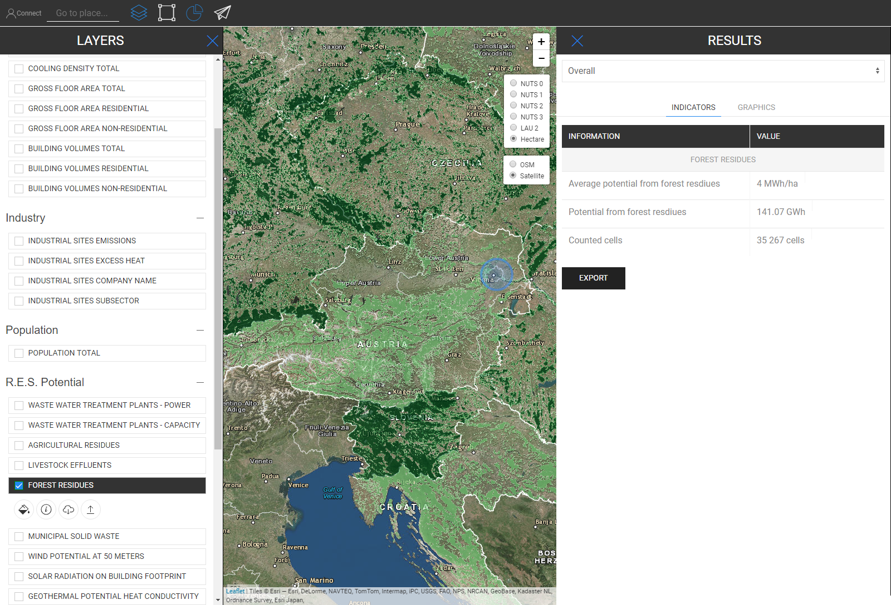
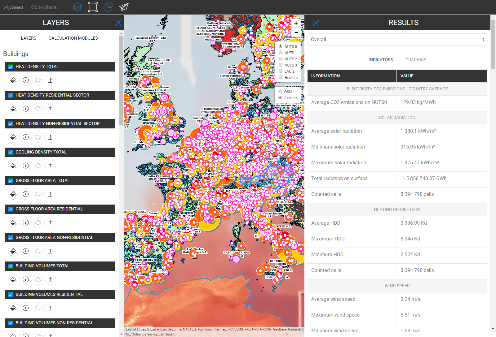

<h1><a class="anchor" id="retrieve-indicators-of-a-selected-area" href="#retrieve-indicators-of-a-selected-area"><i class="fa fa-link"></i></a>Hämta indikatorer för ett valt område</h1><h2><a class="anchor" id="table-of-contents" href="#table-of-contents"><i class="fa fa-link"></i></a> Innehållsförteckning</h2><ul><li> <a href="#introduction">Introduktion</a></li><li> <a href="#indicators-for-raster-layers">Indikatorer för rasterskikt</a><ul><li> <a href="#indicators-for-raster-layers_buildings">Byggnader</a></li><li> <a href="#indicators-for-raster-layers_population">Befolkning</a></li><li> <a href="#indicators-for-raster-layers_renewable-energy-source-potentials">Potentialer för förnybar energi</a></li></ul></li><li> <a href="#indicators-for-vector-layers">Indikatorer för vektorlager</a><ul><li> <a href="#indicators-for-vector-layers_industry">Industri</a></li><li> <a href="#indicators-for-vector-layers_renewable-energy-source-potentials">Potentialer för förnybar energi</a></li><li> <a href="#indicators-for-vector-layers_electricity">Elektricitet</a></li></ul></li><li> <a href="#example">Exempel</a></li><li> <a href="#how-to-cite">Hur man citerar</a></li><li> <a href="#authors-and-reviewers">Författare och granskare</a></li><li> <a href="#license">Licens</a></li><li> <a href="#acknowledgement">Bekräftelse</a></li></ul><h2><a class="anchor" id="introduction" href="#introduction"><i class="fa fa-link"></i></a> Introduktion</h2>
 Beroende på lager och region som du har valt visas indikatorer för din konfiguration i ett sidofält till höger på skärmen

 <a href="#table-of-contents"><strong><code>To Top</code></strong></a>

 I det följande tittar vi på indikatorerna som visas för raster- och vektorrager.
<h2><a class="anchor" id="indicators-for-raster-layers" href="#indicators-for-raster-layers"><i class="fa fa-link"></i></a> Indikatorer för rasterskikt</h2>
 Indikatorerna på rasterskikt skiljer sig från vektorrager. Med olika menar vi i termer av aggregering och uppdelning. Detta annorlunda beteende kommer från territoriella resolutioner.

 Rasterlager har i allmänhet en mycket högre upplösning medan vektorrager endast har attribut vid punkter eller polygoner.

 Å ena sidan betyder det till exempel att om du väljer ett vektordelager som definieras av NUTS3-polygoner och du till exempel vill välja en LAU-region kommer inte NUTS3-värdet att delas upp till LAU-nivå, utan istället NUTS3-indikatorn där LAU-regionen finns kommer att visas i sidofältet för resultat.

 Å andra sidan är rasterskikt aggregerade och uppdelade &quot;godtyckligt&quot; *

 * av de innehållande cellerna i den region du valde (naturligtvis inom gränsen för själva rasterupplösningen)

 <a href="#table-of-contents"><strong><code>To Top</code></strong></a>
<h3><a class="anchor" id="buildings" href="#buildings"><i class="fa fa-link"></i></a> Byggnader</h3>
 <strong>Karta över värmedensitet</strong>

 <strong>Extra funktion</strong>

 När du väljer värmedensitetsskiktet och Population Layer samtidigt visas en extra indikator (se bilden nedan)

 <a href="#table-of-contents"><strong><code>To Top</code></strong></a>
<h3><a class="anchor" id="in-general-" href="#in-general-"><i class="fa fa-link"></i></a> I allmänhet:</h3>
 När ett av byggnadsskikten och befolkningsskiktet väljs samtidigt visas en extra indikator som beskrivits tidigare

<ins> <code><strong><a href="#indicators-for-raster-layers">To Chapter</a></strong></code></ins>

 <strong>Kyltäthetskarta</strong>

<ins> <code><strong><a href="#indicators-for-raster-layers">To Chapter</a></strong></code></ins>

 <strong>Byggvolymer</strong>

<ins> <code><strong><a href="#indicators-for-raster-layers">To Chapter</a></strong></code></ins>

 <strong>Äckligt golvutrymme</strong>

<ins> <code><strong><a href="#indicators-for-raster-layers">To Chapter</a></strong></code></ins> <a href="#table-of-contents"><strong><code>To Top</code></strong></a>
<h3><a class="anchor" id="population" href="#population"><i class="fa fa-link"></i></a> Befolkning</h3>

<ins> <code><strong><a href="#indicators-for-raster-layers">To Chapter</a></strong></code></ins> <a href="#table-of-contents"><strong><code>To Top</code></strong></a>
<h3><a class="anchor" id="climate" href="#climate"><i class="fa fa-link"></i></a> Klimat</h3>
 <strong>Temperatur</strong>

<ins> <code><strong><a href="#indicators-for-raster-layers">To Chapter</a></strong></code></ins>

 <strong>Cooling Degree Days</strong>

<ins> <code><strong><a href="#indicators-for-raster-layers">To Chapter</a></strong></code></ins>

 <strong>Uppvärmningsdagar</strong>

<ins> <code><strong><a href="#indicators-for-raster-layers">To Chapter</a></strong></code></ins>

 <strong>Solstrålning</strong>

<ins> <code><strong><a href="#indicators-for-raster-layers">To Chapter</a></strong></code></ins>

 <strong>Vindhastighet</strong>

<ins> <code><strong><a href="#indicators-for-raster-layers">To Chapter</a></strong></code></ins> <a href="#table-of-contents"><strong><code>To Top</code></strong></a>
<h3><a class="anchor" id="renewable-energy-source-potentials" href="#renewable-energy-source-potentials"><i class="fa fa-link"></i></a> Potentialer för förnybar energi</h3>
 <strong>Solstrålning på att bygga fotavtryck</strong>

<ins> <code><strong><a href="#indicators-for-raster-layers">To Chapter</a></strong></code></ins>

 <strong>Vindpotential vid 50m</strong>

<ins> <code><strong><a href="#indicators-for-raster-layers">To Chapter</a></strong></code></ins>

 <strong>Skogsrester</strong>

<ins> <code><strong><a href="#indicators-for-raster-layers">To Chapter</a></strong></code></ins> <a href="#table-of-contents"><strong><code>To Top</code></strong></a>
<h2><a class="anchor" id="indicators-for-vector-layers" href="#indicators-for-vector-layers"><i class="fa fa-link"></i></a> Indikatorer för vektorlager</h2><h3><a class="anchor" id="industry" href="#industry"><i class="fa fa-link"></i></a> Industri</h3>
 <strong>Utsläpp från industrianläggningar</strong>

<ins> <code><strong><a href="#indicators-for-vector-layers">To Chapter</a></strong></code></ins>

 <strong>Industriell överflödig värme</strong>

<ins> <code><strong><a href="#indicators-for-vector-layers">To Chapter</a></strong></code></ins>

 <strong>Företagets företagsnamn</strong>

<ins> <code><strong><a href="#indicators-for-vector-layers">To Chapter</a></strong></code></ins>

 <strong>Delsektor för industriell plats</strong>

<ins> <code><strong><a href="#indicators-for-vector-layers">To Chapter</a></strong></code></ins> <a href="#table-of-contents"><strong><code>To Top</code></strong></a>
<h3><a class="anchor" id="renewable-energy-source-potentials" href="#renewable-energy-source-potentials"><i class="fa fa-link"></i></a> Potentialer för förnybar energi</h3>
 <strong>Avloppsreningsverk Kraft</strong>

<ins> <code><strong><a href="#indicators-for-vector-layers">To Chapter</a></strong></code></ins>

 <strong>Avloppsreningsverkens kapacitet</strong>

<ins> <code><strong><a href="#indicators-for-vector-layers">To Chapter</a></strong></code></ins>

 <strong>Jordbruksrester</strong>

<ins> <code><strong><a href="#indicators-for-vector-layers">To Chapter</a></strong></code></ins>

 <strong>Avlopp från boskap</strong>

<ins> <code><strong><a href="#indicators-for-vector-layers">To Chapter</a></strong></code></ins>

 <strong>Kommunalt fast avfall</strong>

<ins> <code><strong><a href="#indicators-for-vector-layers">To Chapter</a></strong></code></ins>

 <strong>Geotermisk potentiell värmeledningsförmåga</strong>

<ins> <code><strong><a href="#indicators-for-vector-layers">To Chapter</a></strong></code></ins> <a href="#table-of-contents"><strong><code>To Top</code></strong></a>
<h3><a class="anchor" id="electricity" href="#electricity"><i class="fa fa-link"></i></a> Elektricitet</h3>
 <strong>El C02-utsläpp</strong>

<ins> <code><strong><a href="#indicators-for-vector-layers">To Chapter</a></strong></code></ins> <a href="#table-of-contents"><strong><code>To Top</code></strong></a>
<h2><a class="anchor" id="example" href="#example"><i class="fa fa-link"></i></a> Exempel</h2>
 På bilden nedan kan du se hur det ser ut när alla lager visualiseras (här är Österrike som NUTS0 valt)

 Även om den här kartan kan se lite förvirrande ut vid första anblicken, är dess indikatorer rakt fram illustrerade. Se nedan alla indikatorer som beskrivs i resultatsidfältet när du väljer alla lager för Österrike (NUTS0)

 <a href="#table-of-contents"><strong><code>To Top</code></strong></a>
<h2><a class="anchor" id="how-to-cite" href="#how-to-cite"><i class="fa fa-link"></i></a> Hur man citerar</h2>
 Jeton Hasani, i Hotmaps-Wiki, Hämta indikatorer-för-ett-valt-område (april 2019)

 <a href="#table-of-contents"><strong><code>To Top</code></strong></a>
<h2><a class="anchor" id="authors-and-reviewers" href="#authors-and-reviewers"><i class="fa fa-link"></i></a> Författare och granskare</h2>
 Denna sida skrevs av Jeton Hasani <strong><a href="https://eeg.tuwien.ac.at/">EEG - TU Wien</a></strong> .

 ☑ Denna sida granskades av Mostafa Fallahnejad <strong><a href="https://eeg.tuwien.ac.at/">EEG - TU Wien</a></strong> .

 <a href="#table-of-contents"><strong><code>To Top</code></strong></a>
<h2><a class="anchor" id="license" href="#license"><i class="fa fa-link"></i></a> Licens</h2>
 Copyright © 2016-2020: Jeton Hasani

 Creative Commons Attribution 4.0 internationell licens

 Detta arbete är licensierat under en Creative Commons CC BY 4.0 International License.

 SPDX-licensidentifierare: CC-BY-4.0

 Licenstext: https://spdx.org/licenses/CC-BY-4.0.html

 <a href="#table-of-contents"><strong><code>To Top</code></strong></a>
<h2><a class="anchor" id="acknowledgement" href="#acknowledgement"><i class="fa fa-link"></i></a> Bekräftelse</h2>
 Vi vill förmedla vår djupaste uppskattning till Horizon 2020 <a href="https://www.hotmaps-project.eu">Hotmaps-projektet</a> (bidragsöverenskommelse nummer 723677), som gav finansieringen för att genomföra denna undersökning.

 <a href="#table-of-contents"><strong><code>To Top</code></strong></a> <code><a href="Indicator-Section/_edit">Review this page</a></code>

<!--- THIS IS A SUPER UNIQUE IDENTIFIER -->

This page was automatically translated. View in another language:

[English](../en/Retrieve-indicators-of-a-selected-area) (original) [Bulgarian](../bg/Retrieve-indicators-of-a-selected-area)\* [Czech](../cs/Retrieve-indicators-of-a-selected-area)\* [Danish](../da/Retrieve-indicators-of-a-selected-area)\* [German](../de/Retrieve-indicators-of-a-selected-area)\* [Greek](../el/Retrieve-indicators-of-a-selected-area)\* [Spanish](../es/Retrieve-indicators-of-a-selected-area)\* [Estonian](../et/Retrieve-indicators-of-a-selected-area)\* [Finnish](../fi/Retrieve-indicators-of-a-selected-area)\* [French](../fr/Retrieve-indicators-of-a-selected-area)\* [Irish](../ga/Retrieve-indicators-of-a-selected-area)\* [Croatian](../hr/Retrieve-indicators-of-a-selected-area)\* [Hungarian](../hu/Retrieve-indicators-of-a-selected-area)\* [Italian](../it/Retrieve-indicators-of-a-selected-area)\* [Lithuanian](../lt/Retrieve-indicators-of-a-selected-area)\* [Latvian](../lv/Retrieve-indicators-of-a-selected-area)\* [Maltese](../mt/Retrieve-indicators-of-a-selected-area)\* [Dutch](../nl/Retrieve-indicators-of-a-selected-area)\* [Polish](../pl/Retrieve-indicators-of-a-selected-area)\* [Portuguese (Portugal, Brazil)](../pt/Retrieve-indicators-of-a-selected-area)\* [Romanian](../ro/Retrieve-indicators-of-a-selected-area)\* [Slovak](../sk/Retrieve-indicators-of-a-selected-area)\* [Slovenian](../sl/Retrieve-indicators-of-a-selected-area)\*  

\* machine translated
